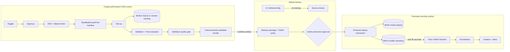

# Architecture — Medical Image Classification MLOps

## Scope and safety boundary

This project classifies dermatology images into the **canonical 9-class contract** in
`training/model.py`. It is a decision-support prototype, not a clinical diagnostic device.
Raw Kaggle Train/Test data remain immutable benchmark input: hash groups are used only to
avoid Train/Validation leakage, never to delete, deduplicate, or relabel samples.

## Runtime components



| Component | Responsibility | Persistent state |
|---|---|---|
| `training/ingest.py` | Idempotent Kaggle download | ignored `data/` directory |
| `training/eda_skin_cancer.py` | Image validation, SHA-256 observations, EDA evidence | ignored `artifacts/eda/` |
| `training/dataset.py` | Reproducible grouped Train/Validation split | manifest and split summary |
| `training/train.py` | CUDA/AMP training, MLflow, best checkpoint selection by Validation macro F1 | checkpoint/run history/MLflow artifacts |
| `training/pipeline.py` | Candidate lifecycle and checksummed evidence bundle | `artifacts/pipeline/candidate/v<N>/` |
| `training/quality_gate.py` | Validation absolute thresholds and champion regression guard | `quality_gate.json` |
| `training/model_registry.py` | Immutable MinIO object keys and production metadata | `model-registry` bucket |
| `training/deploy.py` | Protected publish, Triton health/smoke test, targeted rollback | deployment metadata + `models` bucket |
| Triton | Loads ONNX model repository from MinIO | model-ready REST/gRPC service |
| Prometheus/Grafana | Serving health and latency/error observability | configured volumes |

## Continuous Training

`Train candidate model` is a trusted workflow, not a GitHub-hosted CI job. It runs on a
pre-provisioned CUDA runner and executes exactly this path:

```text
Kaggle ingest → EDA → grouped manifest → train + MLflow
→ Validation evaluation → Test evaluation → Validation quality gate
→ candidate bundle artifact
```

The quality gate checks only Validation metrics:

- `accuracy >= 0.50`;
- `balanced_accuracy >= 0.50`;
- `macro_f1 >= 0.50`;
- candidate macro F1 may not regress more than `0.02` against the current champion.

Thresholds can be supplied explicitly to the local CLI or workflow. The raw Kaggle Test split is
still evaluated and retained in the candidate bundle, but never determines promotion.

Each candidate bundle has a positive, monotonically increasing integer version and includes:

```text
best_checkpoint.pth        self-describing checkpoint
quality_gate.json          decision, checks, thresholds, validation metrics
candidate.json             Git SHA, MLflow run ID, checkpoint SHA-256
checksums.json             SHA-256 for every bundle artifact
evaluations/val/           validation metrics/predictions/confusion matrix
evaluations/test/          benchmark-only test report
manifest_summary.json      split/leakage evidence
eda_summary.json           data-quality evidence
pipeline_summary.json      lifecycle status and version
```

A rejected candidate returns a nonzero status so no CD workflow starts, but its diagnostics are
still uploaded for audit.

## Gated Continuous Delivery

`Release model` is intentionally split into two trust levels.

1. **Package job — GitHub-hosted CPU runner**
   - accepts only the artifact from a successful `Train candidate model` run on `main` from this
     repository;
   - downloads it to the runner temporary directory, validates bundle checksums and repeats the
     Validation gate;
   - exports the self-describing checkpoint to ONNX and verifies PyTorch/ONNX Runtime numerical
     parity;
   - has no MinIO/Triton secret.
2. **Deploy job — protected self-hosted runner**
   - pauses at GitHub Environment `model-production` before any protected secret is exposed;
   - registers immutable checkpoint objects under
     `model-registry/skin_classifier/<version>/`;
   - publishes verified ONNX/config/labels to `models/skin_classifier/<version>/`;
   - waits at most 60 seconds for Triton version readiness, then sends a `(1, 3, 224, 224)` JSON
     tensor and requires output logits `(1, 9)`;
   - writes `production.json` only after all checks pass.

## Deployment state and rollback

The registry uses distinct object categories:

| Location | Mutability | Purpose |
|---|---|---|
| `model-registry/skin_classifier/<N>/best_checkpoint.pth` | immutable | source checkpoint for reproducible release |
| `model-registry/skin_classifier/<N>/candidate.json` | immutable | candidate provenance |
| `model-registry/skin_classifier/<N>/quality_gate.json` | immutable | gate decision |
| `model-registry/skin_classifier/<N>/deployment.json` | audit status | success/failure evidence |
| `model-registry/skin_classifier/production.json` | mutable pointer | current promoted champion metadata |
| `models/skin_classifier/<N>/model.onnx` | immutable version | Triton serving artifact |

Triton keeps the two latest versions through `version_policy`. A deployment failure removes only
`models/skin_classifier/<candidate-version>/`; it neither restarts services nor deletes the previous
production version. The checkpoint and failed deployment record remain for diagnosis.

## Trust boundaries and required configuration

| Boundary | Control |
|---|---|
| Kaggle credentials | repository secrets `KAGGLE_USERNAME`, `KAGGLE_KEY`; never artifact or log values |
| Training | `self-hosted`, `Windows`, `X64`, `mlops-train` runner with CUDA; trusted `main` push/manual run only |
| Artifact handoff | source workflow/run/repository/branch validated; checksum manifest validated outside workspace |
| Deployment | `model-production` Environment requires reviewer approval and prevents self-review |
| Serving credentials | environment-scoped `MINIO_ENDPOINT`, `MINIO_ACCESS_KEY`, `MINIO_SECRET_KEY`, `TRITON_HTTP_URL` only |
| Model contract | self-describing checkpoint, ONNX parity and Triton `(batch, 9)` shape checks |
| Observability | Prometheus scrapes Triton metrics; Grafana/alert rules expose availability, errors and latency |

## Explicit non-goals and remaining work

- The FastAPI image-upload gateway, Grad-CAM and fairness reports remain separate, unfinished
  features. Current Triton API accepts preprocessed tensors, not image files.
- MinIO/Grafana Compose credentials are development defaults and must be replaced before public or
  production use.
- The pipeline validates deployment readiness but does not yet implement automatic traffic splitting,
  model drift detection, load testing, TLS, OIDC, or infrastructure-as-code.
