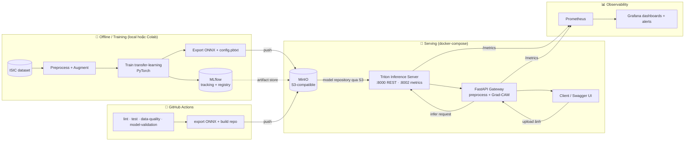

# PLAN — DDM501 Final Project

**Domain:** Healthcare & Life Sciences · **Topic 6 — Medical Image Classification**
**Bài toán:** Phân loại ảnh y tế hỗ trợ bác sĩ phát hiện bất thường.
**Dataset đề xuất:** ISIC Skin Cancer (nhị phân *benign / malignant*, dùng subset cân bằng) — chọn vì cho câu chuyện **fairness theo tông da / giới / tuổi** mạnh nhất ở phần Responsible AI. *(Có thể đổi sang APTOS Diabetic Retinopathy nếu muốn nhẹ hơn.)*

**Stack đã chốt:** MinIO · Triton Inference Server · MLflow · FastAPI (gateway) · Prometheus · Grafana · GitHub Actions · Docker Compose

---

## 1. Nguyên tắc thắng (đọc trước khi làm)

Đây là môn **MLOps**, không phải môn modeling. ~70% điểm nằm ở *hệ thống* (Implementation + Design + Testing/CI-CD + Docs). Vì vậy:

1. **Model phải NHỎ:** transfer learning, backbone nhẹ (EfficientNet-B0 / ResNet18 / MobileNetV2), freeze backbone, chỉ train head.
2. **Serve trên CPU:** không nhét CUDA vào runtime → tránh image phình.
3. **KHÔNG train trong CI:** train offline (máy/Colab), CI chỉ test + validate + đóng gói + đẩy model.
4. **Không bake model vào image:** model nằm ở MinIO, Triton kéo về khi khởi động.
5. **Không bỏ Responsible AI:** 10% điểm, bắt buộc có Grad-CAM + phân tích fairness theo subgroup.

---

## 2. Kiến trúc hệ thống



**Luồng chính:** Client upload ảnh → **FastAPI gateway** (tiền xử lý + Grad-CAM + logic nghiệp vụ) → **Triton** (suy luận model ONNX nạp từ **MinIO**) → trả `{class, confidence, heatmap}`. Triton + gateway phát metrics → **Prometheus** → **Grafana**.

**Vì sao có gateway riêng?** Triton phát REST chuẩn KServe (in/out là tensor), không nhận trực tiếp file ảnh. Gateway FastAPI lo phần: nhận upload, resize/normalize, gọi Triton, sinh Grad-CAM, và **tự sinh Swagger/OpenAPI** (ăn điểm phần F).

---

## 3. Các service trong `docker-compose`

| Service | Image | Vai trò |
|---|---|---|
| `minio` | `minio/minio` | Object store S3 — chứa Triton model repository + MLflow artifacts |
| `minio-init` | `minio/mc` | Tạo bucket `models` lúc khởi động |
| `mlflow` | `ghcr.io/mlflow/mlflow` | Tracking server + model registry |
| `triton` | `nvcr.io/nvidia/tritonserver` (CPU) | Serve model, `--model-repository=s3://minio:9000/models/...` |
| `gateway` | *(code của nhóm)* | FastAPI: upload ảnh, tiền xử lý, gọi Triton, Grad-CAM, /metrics |
| `prometheus` | `prom/prometheus` | Scrape metrics của triton + gateway |
| `grafana` | `grafana/grafana` | Dashboard + alerting |

> ⚠️ Triton kết nối MinIO qua giao thức S3: cần set `AWS_ACCESS_KEY_ID`, `AWS_SECRET_ACCESS_KEY`, endpoint MinIO. Xác nhận đúng cú pháp chuỗi `s3://` + endpoint khi implement.

---

## 4. Cấu trúc repository

```
MLOps/
├── README.md                      # Tổng quan, setup, usage (phần F)
├── ARCHITECTURE.md                # Thiết kế hệ thống + sơ đồ (phần B)
├── CONTRIBUTING.md                # Vai trò từng thành viên
├── PLAN.md                        # File này
├── requirements.txt
├── .gitignore
├── docker-compose.yml
│
├── data/                          # (gitignore) dataset local
│
├── training/                      # ML pipeline (phần C)
│   ├── ingest.py                  # tải + split data
│   ├── preprocess.py              # resize / normalize / augment
│   ├── dataset.py
│   ├── train.py                   # transfer learning + log MLflow
│   ├── evaluate.py                # AUC, confusion matrix, per-subgroup
│   └── export_triton.py           # PyTorch -> ONNX + sinh config.pbtxt
│
├── model_repository/              # layout chuẩn Triton (đẩy lên MinIO)
│   └── skin_classifier/
│       ├── config.pbtxt
│       └── 1/
│           └── model.onnx
│
├── gateway/                       # FastAPI serving (phần C)
│   ├── main.py                    # endpoints + Swagger
│   ├── triton_client.py           # gọi Triton
│   ├── gradcam.py                 # explainability (phần E)
│   ├── metrics.py                 # custom Prometheus metrics
│   ├── Dockerfile
│   └── requirements.txt
│
├── responsible_ai/                # phần E
│   ├── fairness.py                # subgroup performance (Fairlearn)
│   └── report.md                  # bias + privacy + ethics
│
├── monitoring/
│   ├── prometheus/prometheus.yml
│   ├── prometheus/alert_rules.yml
│   └── grafana/dashboards/*.json
│
├── tests/                         # phần D
│   ├── test_data_quality.py
│   ├── test_preprocess.py
│   ├── test_api.py                # integration test endpoint
│   └── test_model_validation.py   # AUC >= ngưỡng
│
└── .github/workflows/
    ├── ci.yml                     # lint + test + data-quality + model-validation
    └── release-model.yml          # export ONNX + push lên MinIO
```

---

## 5. Kế hoạch 4 tuần (Session 5 → 10)

### Tuần 1 — Nền móng & dữ liệu
- [ ] Chốt dataset, tải về, viết `ingest.py` + split train/val/test.
- [ ] `preprocess.py`: resize, normalize, augment; **data quality test** cơ bản.
- [ ] Viết **Problem Definition & success metrics** 3 tầng (phần A).
- [ ] Dựng khung repo + `.gitignore` + `requirements.txt` + branch protection.
- [ ] Dựng `docker-compose` khung: MinIO + MLflow chạy được.

### Tuần 2 — Model & serving
- [ ] `train.py`: transfer learning + **log MLflow** (params, AUC, confusion matrix).
- [ ] `evaluate.py` + chọn best model → đăng ký MLflow registry.
- [ ] `export_triton.py`: ONNX + `config.pbtxt`; đẩy `model_repository` lên MinIO.
- [ ] **Triton** load được model từ MinIO; gọi thử inference.
- [ ] **FastAPI gateway**: endpoint upload ảnh → gọi Triton → trả kết quả; Swagger chạy.
- [ ] Unit test cho preprocess + gateway.

### Tuần 3 — Observability & CI/CD
- [ ] Gắn metrics: Triton `:8002` + custom metrics gateway (latency, phân phối confidence & class).
- [ ] **Prometheus** scrape + **Grafana** dashboard (perf + model health).
- [ ] **Alert rules** (latency cao, error rate, confidence trung bình tụt → drift proxy).
- [ ] **GitHub Actions** `ci.yml` (lint + test + data-quality + model-validation).
- [ ] `release-model.yml`: export + push model lên MinIO.
- [ ] Integration test toàn cụm bằng docker-compose.

### Tuần 4 — Responsible AI, Docs & Demo
- [ ] **Grad-CAM** trả kèm response / endpoint riêng.
- [ ] **Fairness analysis** theo subgroup (giới, tuổi, vị trí/tông da) — `report.md`.
- [ ] **Privacy (HIPAA)** + ethics discussion.
- [ ] Hoàn thiện README, ARCHITECTURE.md, CONTRIBUTING.md, API docs.
- [ ] Chuẩn bị slide + **live demo** (mọi người tham gia) + tập Q&A.
- [ ] Rà **rubric checklist** (mục 7) đảm bảo không sót.

---

## 6. Phân vai (5 người)

> ⚠️ Đề quy định team **3–4 người**. Nhóm 5 người cần **xác nhận với giảng viên** trước.

| Người | Vai trò | Sở hữu chính |
|---|---|---|
| **1 — Data Engineer** | Data pipeline | `training/ingest.py`, `preprocess.py`, `dataset.py`, data-quality tests, phần A |
| **2 — ML/CV Lead** | Model | `train.py`, `evaluate.py`, MLflow, `export_triton.py`, model-validation test |
| **3 — Serving/Infra** | Triton + Gateway | `gateway/`, `model_repository/`, MinIO, `docker-compose`, phần B |
| **4 — MLOps/Observability** | Monitor + CI/CD | `monitoring/`, `.github/workflows/`, integration test, phần D |
| **5 — Responsible AI + Docs** | Ethics + Tài liệu | `responsible_ai/`, README/ARCHITECTURE/CONTRIBUTING, Swagger, dẫn dắt slide (phần E, F) |

**Quy tắc chung:** mỗi người tự viết unit test cho phần mình. **Mọi thành viên phải có commit ý nghĩa và cùng tham gia demo** (yêu cầu bắt buộc của đề).

---

## 7. Rubric → Deliverable (checklist chấm điểm)

| Phần | % | Deliverable trong repo | Trạng thái |
|---|---|---|---|
| **A. Problem Definition** | 10 | README §Problem + success metrics 3 tầng | ☐ |
| **B. System Design** | 15 | `ARCHITECTURE.md` + sơ đồ mermaid + trade-off analysis | ☐ |
| **C. Implementation** | 40 | `training/` (MLflow) + `gateway/`+Triton (REST, Docker, compose) + `monitoring/` (Prometheus, Grafana, alerts) | ☐ |
| **D. Testing & CI/CD** | 15 | `tests/` (unit, integration, data-quality, model-validation) + `.github/workflows/` | ☐ |
| **E. Responsible AI** | 10 | Grad-CAM + fairness `report.md` + privacy/ethics | ☐ |
| **F. Documentation** | 10 | README + ARCHITECTURE + CONTRIBUTING + Swagger/OpenAPI | ☐ |

---

## 8. Success metrics 3 tầng (gợi ý cho phần A)

- **Business:** giảm thời gian sàng lọc của bác sĩ; tăng tỉ lệ phát hiện sớm ca ác tính (ưu tiên **recall/sensitivity** vì bỏ sót nguy hiểm hơn báo nhầm).
- **System:** p95 latency của gateway < X ms; uptime; throughput req/s (đo qua Prometheus).
- **Model:** AUC ≥ ngưỡng, recall lớp *malignant* ≥ ngưỡng, **chênh lệch hiệu năng giữa các subgroup < ngưỡng** (fairness).

---

## 9. Rủi ro & cách xử lý

| Rủi ro | Cách xử lý |
|---|---|
| Dataset quá nặng | Dùng **subset cân bằng**, không lấy full |
| Image Triton lớn, GPU | Dùng bản **CPU**, model ONNX nhẹ; gateway image nhỏ |
| CI timeout do train | **Không train trong CI**; test bằng model tí hon / mock |
| MLflow model ≠ định dạng Triton | Bước **export ONNX + `config.pbtxt`** bắt buộc trong pipeline |
| Quên fairness (mất 10%) | Đưa fairness thành **task riêng tuần 4** có người sở hữu |
| Demo hỏng khi chấm | **`docker-compose up` một lệnh** chạy cả cụm; tập demo trước |

---

## 10. Chuẩn bị thuyết trình (15–20’ + 10’ Q&A)

1. Bài toán & bối cảnh y tế (phần A) — 2’
2. Kiến trúc hệ thống + vì sao chọn Triton/MinIO (phần B) — 4’
3. **Live demo:** upload ảnh → kết quả + Grad-CAM; mở Grafana; xem MLflow — 6’
4. CI/CD chạy trên GitHub + testing (phần D) — 3’
5. Responsible AI: fairness + explainability + privacy (phần E) — 3’
6. Q&A — 10’

> Mọi thành viên nói phần mình sở hữu (đề yêu cầu tất cả cùng demo).
```
