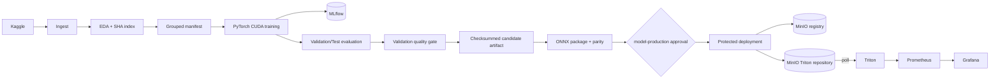

# PLAN — DDM501 Final Project

**Domain:** Healthcare & Life Sciences · **Topic 6 — Medical Image Classification**  
**Problem:** Support classification of dermatology images into the canonical **9-class** contract.  
**Dataset:** Kaggle Skin Cancer ISIC — 2,357 images. Raw Train/Test remains immutable; internal
Validation is generated from Train with SHA-256 grouping to prevent leakage.

## Delivery principles

1. This is an MLOps/DevOps project, not a benchmark-tuning exercise.
2. Kaggle Test is report-only after model selection; promotion gates use Validation only.
3. Standard GitHub-hosted CI stays lightweight. Real training is a separate trusted CUDA workflow.
4. Checkpoints and ONNX artifacts are never committed. MinIO stores immutable model versions.
5. Model publishing is protected by a GitHub Environment approval, parity checks and Triton smoke
   inference; failure rolls back only the candidate model prefix.
6. The project is a decision-support prototype, not autonomous medical diagnosis.

## Implemented architecture



Details and trust boundaries are documented in [ARCHITECTURE.md](ARCHITECTURE.md).

## CI/CD workflow roles

| Workflow | Runner | Trigger | Responsibility |
|---|---|---|---|
| `ci.yml` | GitHub-hosted Ubuntu | push/PR | Ruff, unit/data/model-contract tests, Compose/Prometheus/Grafana validation; never trains. |
| `train-model.yml` | trusted `mlops-train` CUDA runner | push to `main`/manual | Ingest, EDA, grouped manifest, training, MLflow, Validation/Test reports, quality-gated candidate bundle. |
| `release-model.yml` package | GitHub-hosted Ubuntu CPU | successful trusted training run/manual source run | Artifact provenance/checksum validation and PyTorch→ONNX parity. No serving secrets. |
| `release-model.yml` deploy | protected `mlops-deploy` runner | after `model-production` approval | Immutable registry upload, ONNX publish, Triton readiness/smoke test, production pointer update. |

## Candidate quality policy

Default Validation gate:

```text
accuracy >= 0.50
balanced_accuracy >= 0.50
macro_f1 >= 0.50
macro_f1 regression vs champion <= 0.02
```

Thresholds are explicit CLI/workflow configuration. A rejected candidate remains an audit artifact
but does not trigger CD. Model versions must increase monotonically; a successful deployment keeps two Triton versions, while a failed candidate only removes its own serving prefix and preserves the prior production model.

## Required GitHub setup

- `mlops-train` runner labels: `self-hosted`, `Windows`, `X64`, `mlops-train`, with CUDA PyTorch.
- `mlops-deploy` runner labels: `self-hosted`, `Windows`, `X64`, `mlops-deploy`, network access to
  MinIO/Triton.
- Repository secrets: `KAGGLE_USERNAME`, `KAGGLE_KEY`.
- Environment `model-production`: required reviewers, prevent self-review, secrets
  `MINIO_ENDPOINT`, `MINIO_ACCESS_KEY`, `MINIO_SECRET_KEY`, `TRITON_HTTP_URL`.
- Optional repository variables: `MLOPS_DATA_DIR`, `MLFLOW_TRACKING_URI`.

## Delivery status

| Area | Current status |
|---|---|
| Ingest, EDA, grouped split | Implemented |
| PyTorch training, CUDA/AMP, MLflow, evaluation | Implemented |
| Validation quality gate and checksummed candidate artifact | Implemented |
| ONNX parity, immutable MinIO registry, targeted deploy rollback | Implemented in code and mocked tests |
| GitHub CI / trusted CT / protected CD workflows | Implemented; requires repository runner/environment/secrets setup before live execution |
| Compose, Triton, Prometheus, Grafana | Implemented configuration |
| FastAPI gateway / image upload / Swagger | Not implemented |
| Grad-CAM / subgroup fairness | Not implemented |
| Production TLS, OIDC, drift/load testing, canary traffic | Not implemented |

## Verification targets

1. `ruff check .` and `ruff format --check .`.
2. `pytest`, with no raw-data, Kaggle or Docker dependency in unit tests.
3. `docker compose config --quiet`, Prometheus `promtool`, Grafana JSON validation.
4. Local candidate smoke pipeline with low batch limits and explicit zero thresholds; do not upload
   MinIO unless an authorized deployment path is used.
5. In a configured environment, deploy a new positive version and verify Triton output `(1, 9)`,
   `production.json`, and Prometheus metrics.
6. Check `git diff --check`, status and `.gitignore` before staging; never commit or push automatically.
