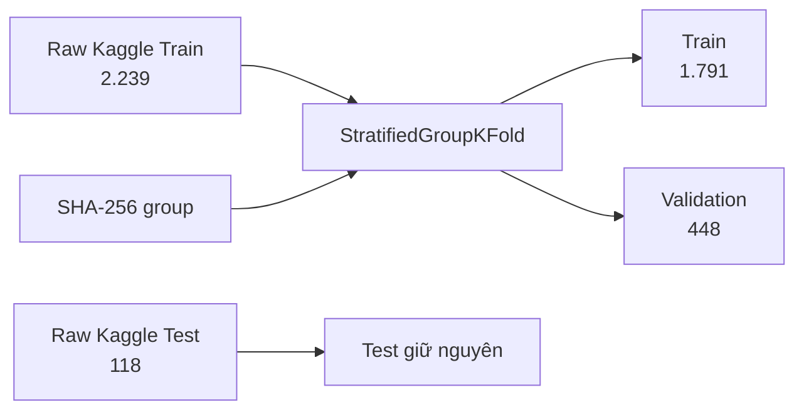
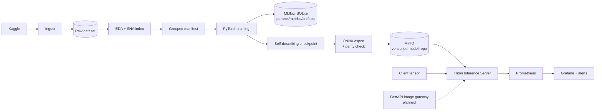
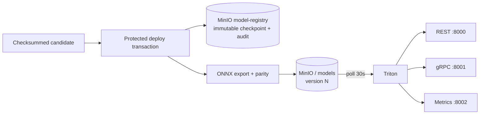

# Medical Image Classification

## Xây dựng vòng đời DevOps/MLOps cho phân loại ung thư da 9 lớp

**Dataset:** Skin Cancer ISIC · **Model:** PyTorch/timm · **Serving:** ONNX + Triton  
**Platform:** MinIO · MLflow · Prometheus · Grafana · GitHub Actions · Docker Compose

<div class="small">
Branch khảo sát: <code>feat/model_development</code> · HEAD <code>76748da</code> · 22/07/2026
</div>

<!--
Thời lượng: 30 giây.
Lời nói gợi ý:
"Đây không chỉ là bài toán huấn luyện một model. Mục tiêu của nhóm là xây dựng toàn bộ vòng đời có thể tái lập: dữ liệu, thí nghiệm, đóng gói, phát hành, phục vụ và giám sát. Trong phần trình bày, em sẽ phân biệt rõ phần đã chạy được, phần đang tích hợp và technical debt còn lại."
-->

---

# 1. Bài toán

### Bối cảnh lâm sàng

- Ung thư da là **loại ung thư phổ biến nhất thế giới**; phát hiện sớm cải thiện đáng kể tỷ lệ sống.
- Bác sĩ da liễu kiểm tra tổn thương bằng mắt, nhưng độ chính xác phụ thuộc kinh nghiệm — phân loại sai có thể trì hoãn điều trị các bệnh ác tính như **melanoma**.
- Phân loại ảnh tự động có thể đóng vai trò **hỗ trợ sàng lọc**, đánh dấu ca nghi ngờ để bác sĩ chuyên khoa xem xét.

### Vấn đề cần giải quyết

- **9 lớp bệnh có hình thái tương tự** khiến việc phân loại khó khăn ngay cả với bác sĩ có kinh nghiệm.
- Dataset công khai (ISIC) có **mất cân bằng lớp** (lên tới 5,97×) và các nhóm **same-content** đi qua raw split — đây là caveat benchmark cần được kiểm soát khi tạo Validation nội bộ.
- Ngoài độ chính xác của model, cần một pipeline chuẩn, tái lập được để đưa model từ thí nghiệm sang dịch vụ có giám sát, quality gate và quản lý phiên bản.

> Model "chạy được trên máy tôi" không phải là một hệ thống. Khoảng cách giữa notebook và dịch vụ triển khai được, quan sát được — chính là nơi MLOps tồn tại.

<!--
Thời lượng: 60 giây.
Đặt nền: đây là bài toán y tế thực với thách thức chất lượng dữ liệu thực. Dự án giải quyết cả bài toán ML lẫn khoảng trống vận hành.
-->

---

# 1b. Mục tiêu và thước đo thành công

### Mục tiêu lâm sàng

Xây dựng **công cụ sàng lọc đáng tin cậy, tái lập được** giúp bác sĩ da liễu nhận diện tổn thương da nghi ngờ trong 9 lớp bệnh — ưu tiên **độ nhạy trên các bệnh ác tính** (melanoma, BCC, SCC) để giảm thiểu bỏ sót chẩn đoán.

### Cách đạt được mục tiêu

| Nhu cầu lâm sàng | Giải pháp MLOps |
|---|---|
| Phân loại chính xác dù dữ liệu nhiễu, mất cân bằng | Training có class weight + split group theo SHA ngăn leakage |
| Kết quả đáng tin — biết *khi nào* model sai | Theo dõi per-class recall/F1 + ưu tiên macro F1 thay vì accuracy |
| Cập nhật model an toàn — không regression ngầm | Checkpoint tự mô tả → ONNX parity gate → phát hành có version |
| Inference luôn sẵn sàng cho quy trình khám | Triton serving với health check + tự nạp model mới |
| Phát hiện suy giảm trước khi ảnh hưởng bệnh nhân | Prometheus metrics + Grafana alerts (latency, lỗi, availability) |
| Thí nghiệm tái lập — ai cũng có thể train lại | MLflow tracking + manifest có seed/fold + CI quality gates |

### Thước đo thành công

| Tầng | Chỉ số chính |
|---|---|
| Model | Validation macro F1, balanced accuracy, **per-class recall** (đặc biệt melanoma) |
| System | Inference success/error, p95 latency, throughput, availability |
| Process | Reproducible build, automated checks, versioned artifacts |

<!--
Thời lượng: 75 giây.
Thông điệp chính: mỗi quyết định MLOps phục vụ một mục đích lâm sàng. Chúng ta không xây pipeline vì pipeline — mà vì bệnh nhân phụ thuộc vào model đúng, luôn sẵn sàng, và cập nhật an toàn.
-->

---

# 2. Vì sao đây là dự án DevOps/MLOps?

```text
Code chạy được ≠ hệ thống vận hành được
```

- **Dev:** ingest, EDA, train, evaluate, export ONNX.
- **Ops:** object storage, model server, metrics, dashboard, alert.
- **Automation:** lint, tests, config validation, release workflow.
- **Governance:** class contract, checkpoint metadata, model version, audit qua MLflow.
- **Feedback loop:** metrics và lỗi production quay lại backlog/retraining.

> Giá trị chính không chỉ là “model dự đoán đúng bao nhiêu”, mà là “có thể lặp lại, phát hành, quan sát và thay thế model an toàn hay không”.

<!--
Thời lượng: 60 giây.
Có thể liên hệ DevOps truyền thống: source artifact là container/binary; trong ML, ta có thêm data artifact, experiment, checkpoint và model artifact.
-->

---

# 3. Dataset và phát hiện EDA

### Nguồn dữ liệu

[**Skin Cancer ISIC — 9 Classes**](https://www.kaggle.com/datasets/nodoubttome/skin-cancer9-classesisic) (Kaggle), trích xuất từ kho lưu trữ **International Skin Imaging Collaboration (ISIC)** — bộ sưu tập ảnh dermatoscopy công khai lớn nhất, được sử dụng rộng rãi trong nghiên cứu học thuật và benchmark AI lâm sàng.

**9 lớp bệnh:** actinic keratosis · basal cell carcinoma (BCC) · dermatofibroma · melanoma · nevus · pigmented benign keratosis · seborrheic keratosis · squamous cell carcinoma (SCC) · vascular lesion

Trong đó, **melanoma, BCC và SCC là ác tính** — phân loại sai các lớp này có chi phí lâm sàng cao nhất.

### Tóm tắt EDA

| Thuộc tính | Kết quả |
|---|---:|
| Tổng ảnh đọc được | **2.357 / 2.357** |
| Số lớp | **9** |
| Raw Train / Test | **2.239 / 118** |
| Tỷ lệ mất cân bằng lớn nhất/nhỏ nhất | **5,975×** |
| Nhóm ảnh cùng SHA-256 | **157** |
| Nhóm same-content đi qua raw Train/Test | **18** |

- Raw Kaggle benchmark được **giữ nguyên**.
- Không tự xóa, deduplicate hoặc relabel dữ liệu public.
- SHA-256 được dùng làm **group key** khi tạo Validation để ngăn leakage nội bộ.

<div class="tiny">
Nguồn artifacts local: <code>artifacts/eda/summary.json</code>, <code>dataset_index.csv</code>.
</div>

<!--
Thời lượng: 75 giây.
Giải thích cẩn thận: cùng byte không đồng nghĩa nhóm tự kết luận ground truth sai. Đây là đặc tính/caveat của benchmark. Chính sách an toàn là bảo toàn raw data và dùng grouping trong split nội bộ.
-->

---

# 4. Chiến lược chia dữ liệu tái lập



- Seed `42`, 5 folds, chọn fold `0`.
- Mọi ảnh cùng `group_id` nằm trong **một** split Train hoặc Validation.
- Kết quả kiểm tra: **Train–Validation group overlap = 0**.
- Manifest lưu path tương đối để có thể chạy trên máy khác.

<!--
Thời lượng: 60 giây.
Điểm DevOps/MLOps: split được materialize thành manifest có seed/fold, thay vì mỗi người tự random split và tạo ra kết quả không so sánh được.
-->

---

# 5. Kiến trúc end-to-end



<div class="small">
**Control plane:** GitHub Actions · **Data/model plane:** Kaggle, MLflow, MinIO · **Serving plane:** Triton · **Observability plane:** Prometheus/Grafana
</div>

<!--
Thời lượng: 90 giây.
Nói rõ nét đứt: FastAPI gateway đang là thiết kế mục tiêu, code hiện tại chưa triển khai. Runtime đang có contract tensor trực tiếp với Triton.
-->

---

# 6. Luồng tóm tắt

## Offline model lifecycle

```text
Kaggle → Ingest → EDA → Manifest → Train → MLflow → Checkpoint
→ Validation gate → Checksummed candidate → ONNX parity
→ Approval → Immutable MinIO version → Triton
```

## Online inference hiện tại

```text
Client tensor → Triton REST/gRPC → ONNX Runtime → 9 logits
→ Triton metrics → Prometheus → Grafana/Alerts
```

## Online inference mục tiêu

```text
Ảnh người dùng → FastAPI → Resize/Normalize → Triton
→ Class/Confidence → Grad-CAM → API response
```

<!--
Thời lượng: 40 giây.
Đây là slide để giảng viên nắm luồng trước khi đi vào từng khối.
-->

---

# 7. Data pipeline: an toàn và tái lập

### Ingest

- Đọc credential từ OS/CI hoặc `.env`, không hard-code Kaggle token.
- Tải vào thư mục tạm, kiểm tra có ảnh rồi mới **atomic replace**.
- Có marker `.download_complete.json`; mặc định idempotent, hỗ trợ `--force`.

### EDA

- Kiểm tra readability, format, dimensions, aspect ratio, file size.
- SHA-256 toàn bộ ảnh để quan sát same-content và source-split overlap.
- Sinh CSV/JSON machine-readable cùng biểu đồ.

### Contract

- 9 class, thứ tự class, input `224×224`, mean/std được định nghĩa tập trung trong `training/model.py`.

<!--
Thời lượng: 60 giây.
Liên hệ DevOps: idempotency, atomic operation, machine-readable artifact và single source of truth đều là nguyên tắc vận hành, không chỉ modeling.
-->

---

# 8. Training pipeline và experiment tracking

- `timm` hỗ trợ:
  - **ResNet18** làm baseline;
  - **ConvNeXtV2-Tiny** làm kiến trúc chính dự kiến.
- Class-weighted cross entropy + label smoothing.
- AdamW, warmup + cosine schedule, gradient clipping.
- Freeze backbone ban đầu, sau đó fine-tune toàn model.
- CUDA AMP để giảm VRAM và tăng tốc.
- Early stopping/chọn checkpoint theo **Validation macro F1**.

### MLflow

- Metadata: `artifacts/mlflow/mlflow.db` — SQLite.
- Theo dõi params, epoch metrics, history, checkpoint và manifest summary.
- Experiment hiện có: `skin-cancer-isic-9-class`, 1 run `FINISHED`.

<!--
Thời lượng: 80 giây.
Nêu lý do SQLite: filesystem backend của MLflow mới ở maintenance mode; SQLite vẫn local nhưng có database semantics và hỗ trợ truy vấn tốt hơn.
-->

---

# 9. Kết quả baseline ResNet18

| Split | Accuracy | Balanced Acc. | Macro F1 | Macro OVR AUC |
|---|---:|---:|---:|---:|
| Validation | 0,603 | 0,610 | **0,560** | 0,919 |
| Kaggle Test | 0,525 | 0,521 | **0,477** | 0,883 |

### Phân tích thay vì chỉ báo một con số

- BCC test F1: **0,788**.
- Melanoma recall: **0,125** — rủi ro bỏ sót cao.
- Seborrheic keratosis recall: **0,000**, nhưng Test chỉ có **3 ảnh**.
- Baseline chứng minh pipeline end-to-end; **chưa đủ tiêu chuẩn dùng lâm sàng**.

<div class="tiny">
Checkpoint: <code>artifacts/training/runs/20260722T050823Z-resnet18-baseline/best_checkpoint.pth</code>
</div>

<!--
Thời lượng: 90 giây.
Không cố che điểm yếu. Với y tế, per-class recall quan trọng hơn accuracy tổng. Baseline là mốc kỹ thuật để kiểm chứng lifecycle, không phải tuyên bố medical performance.
-->

---

# 10. Model artifact và release contract

### Self-describing checkpoint

Checkpoint chứa:

- architecture và `state_dict`;
- 9 class theo đúng thứ tự;
- image size và normalization;
- epoch và validation metrics;
- tùy chọn optimizer/scheduler state.

### Export gate

```text
PyTorch checkpoint → ONNX opset 18 → ONNX Runtime inference
→ kiểm tra shape (1, 9) → so sánh logits
```

- Local parity đã đạt `max_abs_diff = 3,6 × 10⁻⁷` trên baseline.
- Exporter local chỉ upload khi truyền explicit `--upload`; đường production dùng candidate bundle đã checksum và protected deploy transaction.
- Giảm nguy cơ publish model chưa verify, sai contract hoặc ghi đè version đã có.

<!--
Thời lượng: 70 giây.
Điểm chính: model artifact không chỉ là một file weights mơ hồ. Nó tự mô tả contract, và ONNX chỉ được coi là releasable sau khi numerical parity pass.
-->

---

# 11. Serving: MinIO + Triton



- Model repository dùng version số tăng dần; checkpoint và ONNX version không được overwrite.
- Triton sử dụng ONNX Runtime, dynamic batching `[4, 8]`, CPU instance và giữ hai version mới nhất.
- Model tách khỏi container image → cập nhật model không cần build lại application image.
- `production.json` chỉ đổi sau khi version-specific readiness và smoke inference `(1, 9)` pass.

<!--
Thời lượng: 70 giây.
Trade-off: polling phù hợp runtime persistent và không cần restart; GitHub Environment approval,
immutable version và smoke test bổ sung release control, nhưng chưa có canary traffic.
-->

---

# 12. Observability và alerting

### Prometheus scrape

- Triton `:8002/metrics` mỗi 15 giây.
- Prometheus tự giám sát chính nó.
- Gateway target đã được chừa sẵn nhưng hiện chưa có service.

### Grafana dashboard

- Triton ready.
- Total inferences và error count.
- Inference rate.
- Average latency.
- Total latency so với queue latency.

### Alert rules

- `TritonDown` sau 1 phút.
- `TritonInferenceErrors` khi có lỗi trong cửa sổ 5 phút.
- `TritonHighLatency` khi latency trung bình > 500 ms.
- `GatewayDown` là rule dự phòng cho phase tiếp theo.

<!--
Thời lượng: 70 giây.
Nói rõ monitoring hiện tập trung system health. Model drift/data drift chưa được triển khai vì cần thu thập prediction distribution và ground truth feedback.
-->

---

# 13. CI/CD — Continuous Training và gated deployment

## CI nhẹ trên push/PR

```text
Git push / Pull request
├── Ruff lint + format check
├── Unit/data-quality/model-contract tests + coverage
└── Validate Docker Compose + Prometheus + Grafana JSON
```

## Continuous Training — trusted GPU runner

```text
push main/manual
→ ingest → EDA → grouped split → CUDA train + MLflow
→ Validation/Test reports → Validation quality gate
→ checksummed candidate artifact
```

## Gated Continuous Deployment

```text
trusted candidate artifact
→ checksum + gate replay + ONNX parity (GitHub CPU)
→ model-production approval
→ immutable MinIO publish
→ Triton ready + `(1, 9)` smoke test
→ production pointer
```

### Quyết định DevOps quan trọng

- CI nhẹ **không train** trên GitHub-hosted runner.
- Training chỉ chạy trên self-hosted CUDA runner có trust boundary rõ ràng.
- Package job không nhận serving secret; secret chỉ được mở sau Environment approval.
- Failure chỉ rollback prefix Triton của candidate, giữ model production trước đó.

<!--
Thời lượng: 90 giây.
Nêu rõ đây không phải “push là deploy ngay”: quality gate và reviewer approval tránh publish
một model kém chất lượng hoặc artifact không tin cậy.
-->

---

# 14. Testing và quality gates

### Tests được thiết kế cho

- Dataset root, ảnh hỏng, EDA artifacts và grouped split không leakage.
- Transform output/determinism; model output đúng 9 logits.
- Checkpoint round-trip và metric schema giữ đúng shared contract.
- Quality gate: absolute threshold, champion regression và decision artifact.
- Candidate pipeline: bundle schema, checksum và Validation-only promotion.
- Model registry/deploy: immutable version, checksum tamper, readiness retry, smoke `(1, 9)` và targeted rollback.

### Infrastructure validation

- `docker compose config --quiet`.
- Prometheus config/rules qua `promtool`.
- Grafana dashboard phải là JSON hợp lệ.
- Pre-commit: whitespace, YAML/TOML, merge conflict, private key, large files, Ruff.

<!--
Thời lượng: 65 giây.
Nhấn mạnh unit tests dùng mock/fake registry, không phụ thuộc Kaggle, GPU, Docker runtime hoặc production secret.
Live GitHub CT/CD vẫn cần runner và Environment được cấu hình để tạo bằng chứng integration cuối cùng.
-->

---

# 15. Security, reproducibility và vận hành

<div class="good">Đã có</div>

- `.env`, dataset, checkpoint, MLflow DB, artifacts và ONNX được Git ignore.
- Pre-commit phát hiện private key và file lớn.
- Candidate artifact có SHA-256; checkpoint/ONNX version immutable.
- Package job không có serving secrets; deploy secrets thuộc protected Environment `model-production`.
- Raw data được bảo toàn; split, seed, source SHA và deployment audit được ghi lại.

<div class="warn">Cần hardening trước production/public deployment</div>

- MinIO/Grafana trong Compose đang dùng credential demo `minioadmin`, `admin/admin`.
- Một số Docker images dùng tag `latest` → cần pin digest/version.
- Cần short-lived identity/OIDC, least privilege, TLS và network policy.
- Không log ảnh y tế hoặc metadata nhận dạng cá nhân.

<!--
Thời lượng: 65 giây.
Phân biệt rõ demo credentials và production credentials. Đây là điểm giảng viên DevOps thường hỏi.
-->

---

# 16. Responsible AI và giới hạn

- Dataset mất cân bằng `5,975×`.
- Hai class chỉ có 3 mẫu trong Test → metric dao động lớn.
- Baseline có melanoma recall thấp → không phù hợp autonomous diagnosis.
- Same-content xuất hiện trong nhiều folder label là caveat cần nghiên cứu, không tự ý sửa benchmark.
- Dataset hiện không có đủ metadata chuẩn để kết luận fairness theo tuổi, giới, skin tone.
- Thiết kế mục tiêu: Grad-CAM + human-in-the-loop + model card + subgroup analysis.

> **Nguyên tắc:** output là decision support; bác sĩ vẫn là người ra quyết định cuối cùng.

<!--
Thời lượng: 75 giây.
Nói trung thực rằng responsible_ai/fairness và Grad-CAM hiện mới là roadmap, không claim đã implement.
-->

---

# 17. Readiness hiện tại — audit sau lần pull

| Hạng mục | Trạng thái | Bằng chứng / vấn đề |
|---|---|---|
| Ingest + EDA + manifest | <span class="good">Đã triển khai</span> | 2.357 ảnh, split reproducible |
| Training + evaluation + MLflow | <span class="good">Đã chạy</span> | ResNet18 baseline, MLflow run FINISHED |
| ONNX + Triton 9-class contract | <span class="good">Đã verify local</span> | output `(1, 9)`, parity pass |
| Compose + Prometheus + Grafana | <span class="good">Config pass</span> | MinIO/Triton/monitoring |
| CI hiện tại | <span class="good">Đã sửa config/code</span> | TOML/pytest conflict đã được xử lý; cần GitHub run mới để xác nhận remote runner |
| Continuous Training + Release workflow | <span class="good">Đã triển khai workflow</span> | cần self-hosted labels, GitHub Environment approval và secrets trước live deploy |
| FastAPI gateway | <span class="warn">Chưa triển khai</span> | source files hiện rỗng, chưa có compose service |
| Grad-CAM / fairness | <span class="warn">Chưa triển khai</span> | files scaffold rỗng |
| Architecture/Contributing docs | <span class="good">Đã hoàn thiện</span> | trust boundary, candidate/deploy flow và contributor rules |

<!--
Thời lượng: 90 giây.
Có thể nói: “Audit sau pull phát hiện integration drift; nhóm đã chuyển phát hiện đó thành
quality gate, immutable artifact và deployment approval. Một GitHub run mới trên runner đã cấu hình
vẫn là bằng chứng cuối cùng trước khi gọi release production.”
-->

---

# 18. Demo thực tế nên trình bày

## Demo hiện làm được

1. Mở MLflow UI và xem params/metric history của baseline.
2. Mở candidate bundle: Validation/Test reports, `quality_gate.json`, provenance và checksums.
3. `docker compose up -d` cho MinIO, Triton, Prometheus, Grafana.
4. Với credential được cấp, chạy `training.deploy` trên bundle đã verify hoặc trình chiếu protected CD run.
5. Xác nhận Triton version ready, smoke output `(1, 9)` và `production.json`.
6. Mở Prometheus targets/alerts và Grafana dashboard.

## Không nên claim trong demo hiện tại

- Upload file ảnh qua Swagger/FastAPI.
- Grad-CAM hoặc fairness report hoàn chỉnh.
- Workflow live green nếu self-hosted runners/Environment chưa được cấu hình và chạy thật.
- Production/clinical readiness chỉ từ baseline và mocked deployment tests.

<!--
Thời lượng: 60 giây.
Demo phải dựa trên bằng chứng thực. Local recovery deploy chỉ chạy với credential được ủy quyền;
không bypass quality gate bằng cách upload trực tiếp một checkpoint tùy ý.
-->

---

# 19. Trade-offs và bài học DevOps

| Quyết định | Lợi ích | Trade-off |
|---|---|---|
| ONNX + CPU Triton | Portable, runtime nhẹ hơn CUDA | Latency có thể cao hơn GPU |
| MinIO model repository | Tách model khỏi image, immutable version | Thêm dependency và credential management |
| Poll model mỗi 30s + giữ 2 version | Update không restart, có predecessor | Chưa có canary/traffic splitting |
| Không train trong CI | CI nhanh, rẻ, deterministic | Cần trusted GPU runner cho CT |
| Verify candidate trên GitHub CPU | Tách packaging khỏi serving secrets | Phải cài CPU ML dependencies và truyền artifact |
| GitHub Environment approval | Chặn deploy tự động thiếu kiểm soát | Thêm bước chờ reviewer |
| Group split bằng SHA | Ngăn internal leakage | Không thay đổi caveat của raw Test |
| MLflow SQLite local | Dễ chạy, audit experiment | Multi-user scale cần server/database riêng |

<!--
Thời lượng: 75 giây.
Giảng viên thường đánh giá cao khi nhóm giải thích trade-off thay vì liệt kê công nghệ.
-->

---

# 20. Roadmap ưu tiên

### P0 — trước buổi demo

1. Cấu hình self-hosted runners với labels `mlops-train` và `mlops-deploy`.
2. Tạo Environment `model-production`: required reviewer, prevent self-review và serving secrets.
3. Chạy CI → CT → gated CD trên đúng commit trình bày; lưu workflow/artifact/deployment evidence.
4. Rehearse demo và chuẩn bị screenshot/video fallback.

### P1 — hoàn thiện sản phẩm

5. Implement FastAPI gateway + integration tests + compose service.
6. Implement Grad-CAM, model card và Responsible AI report.
7. Hoàn thiện operator runbook/incident procedure.
8. Pin Docker image versions; bổ sung TLS, least privilege và OIDC/short-lived credentials.

### P2 — nâng cao

9. ConvNeXtV2 experiment, drift metrics, canary traffic và load testing.

<!--
Thời lượng: 60 giây.
Đây là kế hoạch có thứ tự theo rủi ro demo và giá trị DevOps, không phải danh sách mong muốn chung chung.
-->

---

# 21. Kết luận

- Project đã có **model lifecycle thực** từ data đến ONNX/Triton và observability.
- Điểm mạnh nhất là reproducibility: manifest, class contract, checkpoint metadata, MLflow, checksums và parity gate.
- Baseline đã chứng minh pipeline nhưng chưa đủ chất lượng y tế.
- Audit sau pull đã được chuyển thành CI repair, Continuous Training, protected deployment và targeted rollback; bằng chứng live vẫn cần runner/Environment được cấu hình.
- Bài học cốt lõi:

> **DevOps không chỉ tự động hóa happy path; DevOps làm cho trạng thái, lỗi và giới hạn của hệ thống trở nên nhìn thấy và có thể xử lý.**

# Q&A

<!--
Thời lượng: 30 giây rồi chuyển Q&A.
-->

---

# Appendix A — Lệnh demo

```powershell
# 1. MLflow UI
python -m mlflow server `
  --backend-store-uri "sqlite:///D:/Dat/FSB/mlops/Medical-Image-Classification/artifacts/mlflow/mlflow.db" `
  --host 127.0.0.1 --port 5000

# 2. Persistent infrastructure
docker compose up -d
docker compose ps

# 3. Authorized local recovery deploy of a checksummed candidate
# MINIO_ENDPOINT, MINIO_ACCESS_KEY, MINIO_SECRET_KEY and TRITON_HTTP_URL
# must already be supplied by an authorized operator.
python -m training.deploy `
  --bundle-dir artifacts\pipeline\candidate\v2 `
  --timeout-seconds 60 --poll-seconds 3

# 4. Health checks
curl.exe http://localhost:8000/v2/health/ready
curl.exe http://localhost:8000/v2/models/skin_classifier/ready
curl.exe http://localhost:8002/metrics
```

---

# Appendix B — Các URL khi demo

| Service | URL |
|---|---|
| MLflow | http://127.0.0.1:5000 |
| MinIO Console | http://localhost:9001 |
| Triton REST | http://localhost:8000 |
| Triton Metrics | http://localhost:8002/metrics |
| Prometheus | http://localhost:9090 |
| Prometheus Targets | http://localhost:9090/targets |
| Prometheus Alerts | http://localhost:9090/alerts |
| Grafana | http://localhost:3000 |

<div class="small">
Credential hiện tại chỉ dành cho local demo; không đưa lên production/public environment.
</div>

---

# Appendix C — Câu hỏi giảng viên có thể hỏi

### 1. Vì sao không train model trong CI?

Training cần GPU, data lớn, thời gian dài và có tính stochastic. CI chỉ kiểm tra code/config/contract; training chạy ở trusted GPU workflow. Package job sau đó verify checkpoint thật trong candidate artifact trên CPU trước khi protected deployment.

### 2. Vì sao dùng MinIO thay vì commit model vào Git?

Model là binary artifact lớn, thay đổi thường xuyên. MinIO cung cấp S3 API, versioned object path và tách artifact lifecycle khỏi source lifecycle.

### 3. Vì sao cần Triton khi ONNX Runtime đã infer được?

ONNX Runtime là inference engine. Triton bổ sung protocol server, model repository, versioning, dynamic batching, health endpoints và Prometheus metrics.

### 4. Vì sao chọn macro F1?

Dữ liệu mất cân bằng; macro F1 cho mỗi lớp trọng số ngang nhau, tránh class lớn che khuất class hiếm.

### 5. Tại sao giữ Kaggle Test dù có same-content overlap?

Để bảo toàn benchmark public. Nhóm không dùng Test để tune; leakage nội bộ được ngăn ở Train/Validation bằng SHA grouping.

---

# Appendix D — Q&A kỹ thuật nâng cao

### Làm thế nào rollback model?

Triton giữ hai version mới nhất. Nếu candidate không ready hoặc smoke inference sai contract, deployer
chỉ xóa `models/skin_classifier/<candidate-version>/`, giữ production version trước và ghi failed
deployment record. `production.json` chỉ được cập nhật sau khi candidate pass toàn bộ transaction.

### Làm thế nào phát hiện model drift?

Hiện mới có system metrics. Bước tiếp theo là gateway phát prediction/confidence distribution, theo dõi PSI/KL hoặc class distribution shift, và kết hợp ground truth delayed feedback.

### Fairness được đo thế nào?

Cần metadata subgroup đáng tin cậy như tuổi, giới, vị trí tổn thương hoặc skin tone. Dataset hiện tại chưa đủ để đưa ra kết luận fairness; không nên tạo subgroup bằng suy đoán từ ảnh.

### Hệ thống đã production-ready chưa?

Chưa. Đây là prototype MLOps có CT/CD contract và mocked deploy tests, nhưng còn cần live workflow evidence trên runner/Environment thật, gateway, security hardening, Responsible AI, load/drift test, TLS và operator runbook trước production hoặc clinical use.

---

# Appendix E — Bằng chứng trong repository

| Nội dung | File |
|---|---|
| Ingest an toàn/idempotent | `training/ingest.py` |
| EDA + SHA index | `training/eda_skin_cancer.py` |
| Grouped split manifest | `training/dataset.py` |
| Shared 9-class contract | `training/model.py` |
| Training + MLflow | `training/train.py` |
| Metrics + reports | `training/metrics.py`, `training/evaluate.py` |
| Candidate orchestration + gate | `training/pipeline.py`, `training/quality_gate.py` |
| Registry + protected deploy | `training/model_registry.py`, `training/deploy.py` |
| ONNX parity/export | `training/export_triton.py` |
| Triton model contract | `model_repository/skin_classifier/` |
| Infrastructure/monitoring | `docker-compose.yml`, `monitoring/` |
| CI / Continuous Training / CD | `.github/workflows/` |
| Automated tests | `tests/` |

---

# Appendix F — Checklist trước khi thuyết trình

- [ ] Chạy local lint/tests/config validation và lưu kết quả trên đúng commit trình bày.
- [ ] Cấu hình `mlops-train`, `mlops-deploy` runners và Environment `model-production`.
- [ ] Chạy thành công CI → candidate training → approved deploy; lưu artifact/workflow evidence.
- [ ] Chuẩn bị sẵn checkpoint/candidate bundle và Docker images để tránh chờ download.
- [ ] Chạy `docker compose up -d` và kiểm tra Triton/monitoring trước giờ demo.
- [ ] Mở sẵn MLflow, GitHub Actions, Prometheus và Grafana trên các tab riêng.
- [ ] Có video/screenshot dự phòng nếu runner, mạng hoặc Docker lỗi.
- [ ] Không demo/tuyên bố gateway, Grad-CAM, fairness hoặc clinical readiness nếu chưa hoàn thiện.
- [ ] Phân vai người nói và người thao tác demo.
