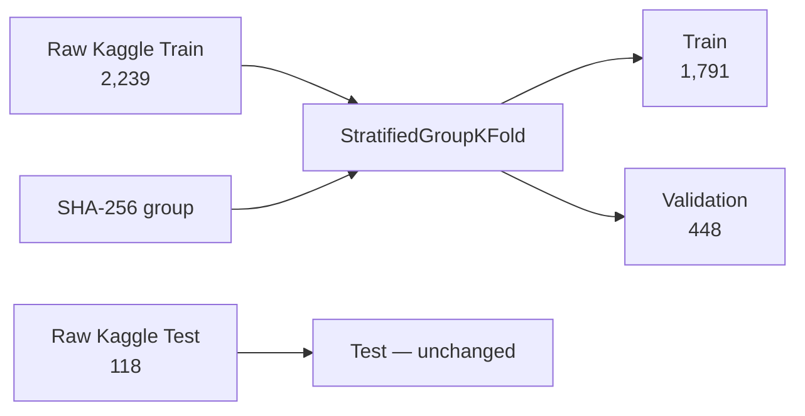
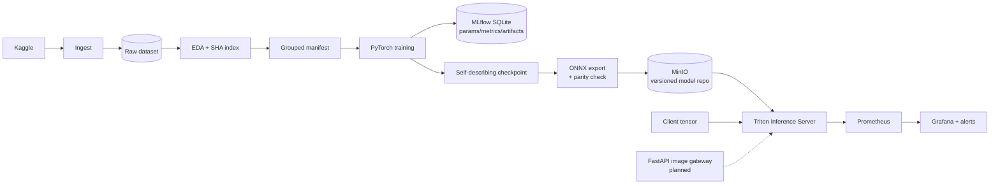
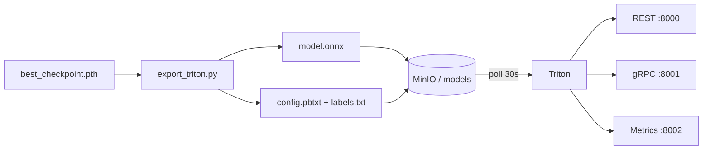

# Medical Image Classification

## Building a DevOps/MLOps Lifecycle for 9-Class Skin Cancer Classification

**Dataset:** Skin Cancer ISIC · **Model:** PyTorch/timm · **Serving:** ONNX + Triton
**Platform:** MinIO · MLflow · Prometheus · Grafana · GitHub Actions · Docker Compose

<div class="small">
Branch: <code>feat/model_development</code> · HEAD <code>76748da</code> · 22/07/2026
</div>

<!--
Duration: 30 seconds.
Speaker notes:
"This project is not just about training a model. Our goal is to build the entire reproducible lifecycle: data, experiments, packaging, release, serving, and monitoring. Throughout this presentation, we will clearly distinguish between what is running, what is being integrated, and what technical debt remains."
-->

---

# 1. Problem Statement

### Clinical Context

- Skin cancer is the **most common cancer worldwide**; early detection significantly improves survival rates.
- Dermatologists visually inspect lesions, but accuracy varies with experience — misclassification can delay treatment of malignant conditions like **melanoma**.
- Automated image classification can serve as a **screening aid**, flagging suspicious cases for specialist review.

### The Problem

- **9 visually similar disease classes** make classification challenging, even for trained clinicians.
- Publicly available datasets (e.g., ISIC) suffer from **class imbalance** (up to 5.97×), **noisy labels**, and **duplicate content across splits** — making naive model training unreliable.
- Beyond model accuracy, there is **no standardized, reproducible pipeline** to take a trained model from experiment to a monitored, versioned production service.

> A model that "works on my machine" is not a system. The gap between a notebook and a deployable, observable service is where MLOps lives.

<!--
Duration: 60 seconds.
Set the stage: this is a real clinical problem with real data quality challenges. The project addresses both the ML challenge and the operational gap.
-->

---

# 1b. Objectives & Success Metrics

### Clinical Objective

Build a **reliable, reproducible screening tool** that helps dermatologists identify suspicious skin lesions across 9 disease classes — prioritizing **sensitivity on malignant conditions** (melanoma, BCC, SCC) to minimize missed diagnoses.

### How We Get There

| Clinical Need | MLOps Solution |
|---|---|
| Accurate classification despite noisy, imbalanced data | Class-weighted training + grouped split to prevent leakage |
| Trustworthy results — know *when* the model is wrong | Per-class recall/F1 tracking + macro F1 over accuracy |
| Safe model updates — no silent regressions | Self-describing checkpoint → ONNX parity gate → versioned release |
| Always-available inference for clinical workflow | Triton serving with health checks + auto model reload |
| Detect degradation before patients are affected | Prometheus metrics + Grafana alerts (latency, errors, availability) |
| Reproducible experiments — any team member can retrain | MLflow tracking + manifest with seed/fold + CI quality gates |

### Success Metrics

| Layer | Key Indicators |
|---|---|
| Model | Validation macro F1, balanced accuracy, **per-class recall** (esp. melanoma) |
| System | Inference success/error rate, p95 latency, throughput, availability |
| Process | Reproducible builds, automated checks, versioned artifacts |

<!--
Duration: 75 seconds.
Key message: every MLOps decision serves a clinical purpose. We don't build pipelines for the sake of pipelines — we build them because patients depend on the model being correct, available, and safely updatable.
-->

---

# 2. Dataset & EDA Findings

### Source

[**Skin Cancer ISIC — 9 Classes**](https://www.kaggle.com/datasets/nodoubttome/skin-cancer9-classesisic) (Kaggle), derived from the **International Skin Imaging Collaboration (ISIC)** archive — the largest public collection of dermatoscopic images used in academic research and clinical AI benchmarks.

**9 classes:** actinic keratosis · basal cell carcinoma (BCC) · dermatofibroma · melanoma · nevus · pigmented benign keratosis · seborrheic keratosis · squamous cell carcinoma (SCC) · vascular lesion

Of these, **melanoma, BCC, and SCC are malignant** — misclassifying them has the highest clinical cost.

### EDA Summary

| Attribute | Result |
|---|---:|
| Total readable images | **2,357 / 2,357** |
| Number of classes | **9** |
| Raw Train / Test | **2,239 / 118** |
| Max/min class imbalance ratio | **5.975×** |
| SHA-256 same-content groups | **157** |
| Same-content groups crossing Train/Test | **18** |

- Raw Kaggle benchmark is **preserved as-is**.
- No automatic deduplication or relabeling of public data.
- SHA-256 hashes serve as **group keys** when creating the Validation split to prevent internal leakage.

<div class="tiny">
Source artifacts: <code>artifacts/eda/summary.json</code>, <code>dataset_index.csv</code>.
</div>

<!--
Duration: 75 seconds.
Explain carefully: same bytes does not mean the team concludes ground truth is wrong. This is a property/caveat of the benchmark. The safe policy is to preserve raw data and use grouping in internal splits only.
-->

---

# 3. Reproducible Data Splitting Strategy



- Seed `42`, 5 folds, fold `0` selected.
- All images sharing a `group_id` land in **one** split (Train or Validation).
- Verified: **Train–Validation group overlap = 0**.
- Manifest uses relative paths for portability across machines.

<!--
Duration: 60 seconds.
DevOps/MLOps point: the split is materialized as a manifest with seed/fold, rather than each contributor randomly splitting and producing incomparable results.
-->

---

# 4. End-to-End Architecture



<div class="small">
<b>Control plane:</b> GitHub Actions · <b>Data/model plane:</b> Kaggle, MLflow, MinIO · <b>Serving plane:</b> Triton · <b>Observability plane:</b> Prometheus/Grafana
</div>

<!--
Duration: 90 seconds.
Explain the dashed line: the FastAPI gateway is the target design; current code has not implemented it yet. Runtime currently uses a direct tensor contract with Triton.
-->

---

# 5. Pipeline Flow Summary

## Offline Model Lifecycle

```text
Kaggle → Ingest → EDA → Manifest → Train → MLflow → Checkpoint
→ ONNX → Parity verification → MinIO → Triton
```

## Current Online Inference

```text
Client tensor → Triton REST/gRPC → ONNX Runtime → 9 logits
→ Triton metrics → Prometheus → Grafana/Alerts
```

## Target Online Inference

```text
User image → FastAPI → Resize/Normalize → Triton
→ Class/Confidence → Grad-CAM → API response
```

<!--
Duration: 40 seconds.
This slide gives the instructor a quick overview of the flow before diving into each block.
-->

---

# 6. Data Pipeline: Safety & Reproducibility

### Ingest

- Reads credentials from OS/CI or `.env` — no hard-coded Kaggle token.
- Downloads to a temp directory, verifies images exist, then performs **atomic replace**.
- Writes `.download_complete.json` marker; idempotent by default, supports `--force`.

### EDA

- Checks readability, format, dimensions, aspect ratio, and file size.
- SHA-256 hashes all images to detect same-content groups and source-split overlap.
- Produces machine-readable CSV/JSON alongside charts.

### Contract

- 9 classes, class ordering, input `224×224`, ImageNet mean/std — all defined centrally in `training/model.py`.

<!--
Duration: 60 seconds.
DevOps connection: idempotency, atomic operations, machine-readable artifacts, and single source of truth are operational principles, not just modeling concerns.
-->

---

# 7. Training Pipeline & Experiment Tracking

- `timm` backbone support:
  - **ResNet18** as baseline;
  - **ConvNeXtV2-Tiny** as intended primary architecture.
- Class-weighted cross entropy + label smoothing (0.1).
- AdamW optimizer, linear warmup + cosine decay, gradient clipping.
- Backbone frozen initially, then full fine-tuning.
- CUDA AMP for reduced VRAM and faster training.
- Early stopping / checkpoint selection by **Validation macro F1**.

### MLflow

- Backend: `artifacts/mlflow/mlflow.db` — SQLite.
- Tracks params, epoch-level metrics, history, checkpoints, and manifest summary.
- Current experiment: `skin-cancer-isic-9-class`, 1 run `FINISHED`.

<!--
Duration: 80 seconds.
Explain SQLite rationale: MLflow's filesystem backend is now in maintenance mode; SQLite is still local but provides database semantics and better query support.
-->

---

# 8. Baseline ResNet18 Results

| Split | Accuracy | Balanced Acc. | Macro F1 | Macro OVR AUC |
|---|---:|---:|---:|---:|
| Validation | 0.603 | 0.610 | **0.560** | 0.919 |
| Kaggle Test | 0.525 | 0.521 | **0.477** | 0.883 |

### Analysis — Not Just Numbers

- BCC test F1: **0.788**.
- Melanoma recall: **0.125** — high risk of missing malignant cases.
- Seborrheic keratosis recall: **0.000**, but Test has only **3 images**.
- Baseline proves the end-to-end pipeline works; **not clinically deployable**.

<div class="tiny">
Checkpoint: <code>artifacts/training/runs/20260722T050823Z-resnet18-baseline/best_checkpoint.pth</code>
</div>

<!--
Duration: 90 seconds.
Do not hide weak points. In healthcare, per-class recall matters more than aggregate accuracy. The baseline is a technical milestone to verify the lifecycle, not a medical performance claim.
-->

---

# 9. Model Artifacts & Release Contract

### Self-Describing Checkpoint

Each checkpoint contains:

- architecture and `state_dict`;
- 9 class names in exact order;
- image size and normalization params;
- epoch and validation metrics;
- optional optimizer/scheduler state.

### Export Gate

```text
PyTorch checkpoint → ONNX opset 18 → ONNX Runtime inference
→ verify shape (1, 9) → compare logits numerically
```

- Local parity achieved: `max_abs_diff = 3.6 × 10⁻⁷`.
- MinIO upload only occurs with explicit `--upload` flag.
- Reduces risk of publishing unverified or contract-violating models.

<!--
Duration: 70 seconds.
Key point: a model artifact is not just an opaque weights file. It self-describes its contract, and ONNX is only considered releasable after numerical parity passes.
-->

---

# 10. Serving: MinIO + Triton



- Model repository versioned by directory number.
- Triton uses ONNX Runtime backend, dynamic batching `[4, 8]`, CPU instance.
- Model is decoupled from container image → updating a model does not require rebuilding the application image.
- `--exit-on-error=false` allows the stack to start with an empty model bucket.

<!--
Duration: 70 seconds.
Trade-off: polling is simple and suitable for demo/local; production needs release approval, rollback policies, and stricter credential management.
-->

---

# 11. Observability & Alerting

### Prometheus Scrape Targets

- Triton `:8002/metrics` every 15 seconds.
- Prometheus self-monitoring.
- Gateway target is pre-configured but has no running service yet.

### Grafana Dashboard

- Triton readiness status.
- Total inferences and error count.
- Inference rate (requests/sec).
- Average latency.
- Total latency vs. queue latency breakdown.

### Alert Rules

- `TritonDown` after 1 minute unreachable.
- `TritonInferenceErrors` when failures occur within a 5-minute window.
- `TritonHighLatency` when average latency > 500 ms.
- `GatewayDown` — placeholder rule for the next phase.

<!--
Duration: 70 seconds.
Be clear that monitoring currently focuses on system health. Model drift / data drift is not yet implemented because it requires collecting prediction distributions and ground truth feedback.
-->

---

# 12. CI/CD Design

## Lightweight CI on Push/PR

```text
Git push / Pull request
├── Ruff lint + format check
├── Unit / data-quality / model-contract tests + coverage
└── Validate Docker Compose + Prometheus rules + Grafana JSON
```

## Heavier Release Workflow

```text
Synthetic checkpoint → ONNX export → Ephemeral MinIO
→ Download round-trip → ONNX Runtime verification
→ GitHub artifact → Optional real Triton smoke test
```

### Key DevOps Decisions

- **No training in CI**: avoids GPU dependency, long runtimes, and costs.
- CI validates the **pipeline contract**, not model quality.
- Ephemeral MinIO lets the runner test the S3 flow without accessing the team's internal MinIO.

<!--
Duration: 90 seconds.
This is a common pattern: training is a separate offline workflow; CI uses fixture or synthetic artifacts to verify the release code path.
-->

---

# 13. Testing & Quality Gates

### Tests Cover

- Dataset root resolution, corrupt images, EDA artifacts.
- Split determinism and zero Train/Val SHA-group overlap.
- Transform output shape and determinism.
- Model outputs exactly 9 logits.
- Checkpoint round-trip preserves contract.
- Metric schema includes macro and per-class results.
- MLflow local URI uses SQLite.

### Infrastructure Validation

- `docker compose config --quiet`: **pass**.
- Prometheus config/rules via `promtool`.
- Grafana dashboard must be valid JSON.
- Pre-commit: whitespace, YAML/TOML, merge conflicts, private keys, large files, Ruff.

<!--
Duration: 65 seconds.
Do not claim all tests are currently green; the readiness slide later will note integration defects found after the merge.
-->

---

# 14. Security, Reproducibility & Operations

<div class="good">Already in Place</div>

- `.env`, dataset, checkpoints, MLflow DB, artifacts, and ONNX files are Git-ignored.
- Pre-commit detects private keys and large files.
- Model publish requires explicit `--upload`; default is local-only verification.
- Raw data is preserved; split seeds and folds are recorded.

<div class="warn">Needs Hardening Before Production/Public Deployment</div>

- MinIO/Grafana use demo credentials: `minioadmin`, `admin/admin`.
- Some Docker images use `latest` tag → need to pin digest/version.
- Requires GitHub Secrets/OIDC, least-privilege access, TLS, and network policies.
- Must not log medical images or personally identifiable metadata.

<!--
Duration: 65 seconds.
Clearly distinguish demo credentials from production credentials. This is a point DevOps instructors commonly probe.
-->

---

# 15. Responsible AI & Limitations

- Dataset imbalance: `5.975×`.
- Two classes have only 3 samples in Test → volatile metrics.
- Baseline melanoma recall is low → unsuitable for autonomous diagnosis.
- Same-content images appearing under different labels is a caveat to study, not to silently "fix" in the benchmark.
- Dataset currently lacks standardized metadata for fairness conclusions by age, gender, or skin tone.
- Target design: Grad-CAM + human-in-the-loop + model card + subgroup analysis.

> **Principle:** output is decision support; the physician always makes the final call.

<!--
Duration: 75 seconds.
Be honest that responsible_ai/fairness and Grad-CAM are currently on the roadmap, not implemented. Do not claim otherwise.
-->

---

# 16. Current Readiness — Post-Merge Audit

| Area | Status | Evidence / Issue |
|---|---|---|
| Ingest + EDA + manifest | <span class="good">Deployed</span> | 2,357 images, reproducible split |
| Training + evaluation + MLflow | <span class="good">Executed</span> | ResNet18 baseline, MLflow run FINISHED |
| ONNX + Triton 9-class contract | <span class="good">Verified locally</span> | output `(1, 9)`, parity pass |
| Compose + Prometheus + Grafana | <span class="good">Config validated</span> | MinIO/Triton/monitoring stack |
| Current CI | <span class="bad">Failing</span> | duplicate `addopts`; dev dependency conflict |
| Release workflow | <span class="bad">Contract drift</span> | still imports `ARCH`, raw state_dict, missing `--upload` |
| FastAPI gateway | <span class="warn">Not implemented</span> | source files are empty, no compose service |
| Grad-CAM / fairness | <span class="warn">Not implemented</span> | scaffold files are empty |
| Architecture/Contributing docs | <span class="warn">Not completed</span> | scaffold files are empty |

<!--
Duration: 90 seconds.
This is the most honest slide. Consider saying: "The audit found integration drift immediately after merging the model branch. This illustrates exactly the DevOps lesson: individual modules passing does not mean the integrated pipeline is green."
-->

---

# 17. Live Demo Scope

## What We Can Demo Today

1. Open MLflow UI — view params/metric history from the baseline run.
2. `docker compose up -d` for MinIO, Triton, Prometheus, Grafana.
3. Export real checkpoint with `--upload` to MinIO.
4. Wait for Triton model ready endpoint.
5. Send a tensor smoke inference → confirm output `(1, 9)`.
6. Open Prometheus targets/alerts and Grafana dashboard.

## What We Will Not Claim in This Demo

- Uploading an image file via Swagger/FastAPI.
- Grad-CAM visualization.
- Complete fairness dashboard/report.
- Green CI/release before fixing the integration defects from slide 16.

<!--
Duration: 60 seconds.
The demo must be based on what actually works. If the gateway and CI are fixed before the grading session, update this slide and then demo the additions.
-->

---

# 18. Trade-Offs & DevOps Lessons

| Decision | Benefit | Trade-off |
|---|---|---|
| ONNX + CPU Triton | Portable, lighter runtime than CUDA | Potentially higher latency than GPU |
| MinIO model repository | Decouples model from image, versioning | Additional dependency and credential mgmt |
| Poll model every 30s | Updates without restarts | Less controlled than GitOps release |
| No training in CI | Fast, cheap, deterministic | Model quality needs a separate pipeline |
| Synthetic checkpoint in release | Tests packaging independently of data/GPU | Does not prove model accuracy |
| Group split by SHA | Prevents internal leakage | Does not change caveats of raw Test |
| MLflow SQLite local | Easy to run, audit experiments | Multi-user scale needs a server/database |

<!--
Duration: 75 seconds.
Instructors typically value groups that explain trade-offs over those that merely list technologies.
-->

---

# 19. Prioritized Roadmap

### P0 — Before Demo Day

1. Unify `pyproject.toml` into a single valid `addopts`.
2. Synchronize pytest versions between `requirements.txt` and `requirements-dev.txt`.
3. Refactor `release-model.yml` to use self-describing checkpoint and explicit `--upload`.
4. Achieve green CI on the exact commit used for the presentation.

### P1 — Product Completion

5. Implement FastAPI gateway + integration tests + compose service.
6. Implement Grad-CAM and Responsible AI report.
7. Complete `ARCHITECTURE.md`, `CONTRIBUTING.md`, model card/runbook.
8. Pin Docker image versions, move credentials to secrets.

### P2 — Enhancement

9. ConvNeXtV2 experiment, drift metrics, canary/rollback, and load testing.

<!--
Duration: 60 seconds.
This is a risk-ordered roadmap based on demo risk and DevOps value, not a generic wish list.
-->

---

# 20. Conclusion

- The project has a **real model lifecycle** from data to ONNX/Triton and observability.
- Greatest strength: reproducibility — manifests, class contracts, checkpoint metadata, MLflow, and the parity gate.
- The baseline proves the pipeline but is **not clinically deployable**.
- Post-merge audit revealed integration drift in CI/release and missing product-facing components.
- Core lesson:

> **DevOps is not just about automating the happy path; it is about making the state, failures, and limitations of a system visible and actionable.**

# Q&A

<!--
Duration: 30 seconds, then transition to Q&A.
-->

---

# Appendix A — Demo Commands

```powershell
# 1. MLflow UI
python -m mlflow server `
  --backend-store-uri "sqlite:///D:/Dat/FSB/mlops/Medical-Image-Classification/artifacts/mlflow/mlflow.db" `
  --host 127.0.0.1 --port 5000

# 2. Infrastructure
docker compose up -d
docker compose ps

# 3. Export + publish real checkpoint
python -m training.export_triton `
  --local-checkpoint artifacts/training/runs/20260722T050823Z-resnet18-baseline/best_checkpoint.pth `
  --version 1 --upload

# 4. Health checks
curl http://localhost:8000/v2/health/ready
curl http://localhost:8000/v2/models/skin_classifier/ready
curl http://localhost:8002/metrics
```

---

# Appendix B — Service URLs for Demo

| Service | URL |
|---|---|
| MLflow | http://127.0.0.1:5000 |
| MinIO Console | http://localhost:9001 |
| Triton REST | http://localhost:8000 |
| Triton Metrics | http://localhost:8002/metrics |
| Prometheus | http://localhost:9090 |
| Prometheus Targets | http://localhost:9090/targets |
| Prometheus Alerts | http://localhost:9090/alerts |
| Grafana | http://localhost:3000 |

<div class="small">
Current credentials are for local demo only; do not use in production/public environments.
</div>

---

# Appendix C — Anticipated Instructor Questions

### 1. Why not train the model in CI?

Training requires GPU, large data, long runtimes, and is stochastic. CI uses test/synthetic checkpoints to verify code, contracts, and release paths; training should be a separate tracked workflow.

### 2. Why MinIO instead of committing the model to Git?

Models are large binary artifacts that change frequently. MinIO provides an S3 API, versioned object paths, and separates artifact lifecycle from source lifecycle.

### 3. Why Triton when ONNX Runtime can already run inference?

ONNX Runtime is the inference engine. Triton adds a protocol server, model repository, versioning, dynamic batching, health endpoints, and Prometheus metrics.

### 4. Why macro F1?

The data is imbalanced; macro F1 gives each class equal weight, preventing large classes from masking the performance on rare classes.

### 5. Why keep the Kaggle Test set despite same-content overlap?

To preserve the public benchmark. The team does not use Test for tuning; internal leakage is prevented at the Train/Validation boundary via SHA grouping.

---

# Appendix D — Advanced Technical Q&A

### How do you roll back a model?

The Triton repository uses numbered version directories. A production process should retain the previous version, check readiness/metrics, and then switch the version policy or remove the faulty version. The current repo does not automate rollback.

### How do you detect model drift?

Currently only system metrics are collected. The next step is for the gateway to emit prediction/confidence distributions, monitor PSI/KL divergence or class distribution shift, and incorporate delayed ground truth feedback.

### How is fairness measured?

Reliable subgroup metadata such as age, gender, lesion location, or skin tone is needed. The current dataset is insufficient for fairness conclusions; subgroups should not be inferred from images.

### Is the system production-ready?

No. This is an MLOps prototype with core blocks running, but it needs green CI, a gateway, security hardening, Responsible AI, load testing, rollback, and a runbook before production.

---

# Appendix E — Repository Evidence Map

| Content | File |
|---|---|
| Safe/idempotent ingest | `training/ingest.py` |
| EDA + SHA index | `training/eda_skin_cancer.py` |
| Grouped split manifest | `training/dataset.py` |
| Shared 9-class contract | `training/model.py` |
| Training + MLflow | `training/train.py` |
| Metrics + reports | `training/metrics.py`, `training/evaluate.py` |
| ONNX parity + MinIO publish | `training/export_triton.py` |
| Triton model contract | `model_repository/skin_classifier/` |
| Infrastructure | `docker-compose.yml` |
| Monitoring | `monitoring/prometheus/`, `monitoring/grafana/` |
| CI/CD | `.github/workflows/` |
| Automated tests | `tests/` |

---

# Appendix F — Pre-Presentation Checklist

- [ ] Fix CI and confirm green badge on the exact commit being presented.
- [ ] Fix release workflow; run successful ephemeral MinIO round-trip.
- [ ] Pre-pull checkpoint and Docker images to avoid download waits during demo.
- [ ] Run `docker compose up -d` and verify Triton readiness before the session.
- [ ] Open MLflow, Prometheus, Grafana in separate browser tabs.
- [ ] Have backup video/screenshots in case of network or Docker failure.
- [ ] Do not demo or claim gateway/Grad-CAM/fairness features unless completed.
- [ ] Assign speaker and demo operator roles to team members.
